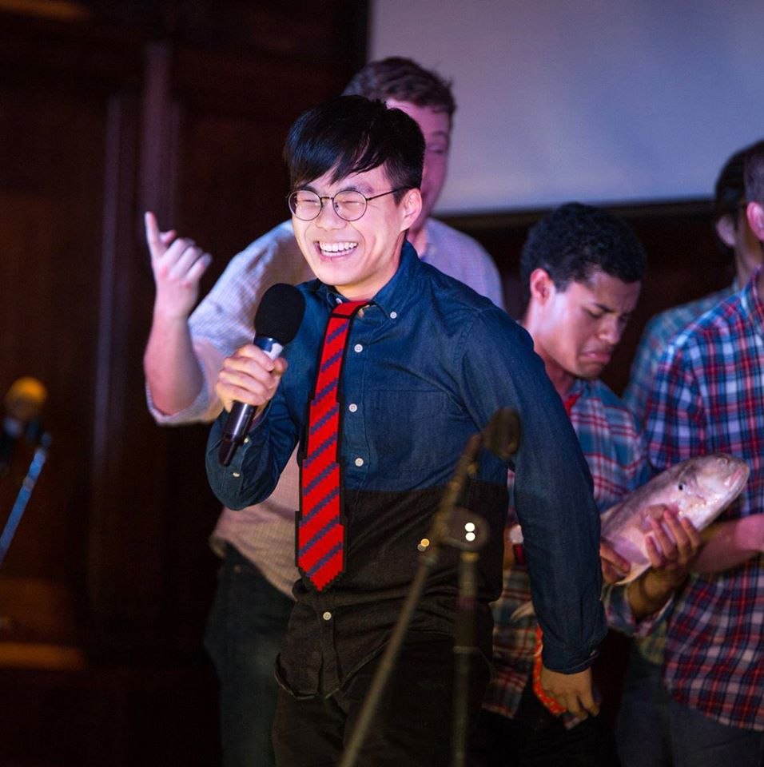

# About Me
 

**Jacob (Sae) Lee**  
Carnegie Mellon University  
[Master of Information Systems Management (MISM)](https://www.heinz.cmu.edu/programs/information-systems-management-master/16-month)  
Grad Dec 2020  

** Looking for Full-Time Employment (post Dec 2020)

-----
### Bio
* Current ML Scientist at ResQ, a startup tackling Cardiovascular Disease (CVD) with DL and IoT
* US Citizen that grew up in South Korea
* Passionate about ML research, particularly in Deep Learning and non-convex optimization

-----
### Previous Associations
* **Data Mining Intern** at [Bosch's Cloud R&D](https://www.boschsecurity.com/xc/en/solutions/services/retail-services/), working on computer vision problems. 
* TA for 11-785 [Introduction to Deep Learning](http://deeplearning.cs.cmu.edu/), where I answered 3400 student questions and wrote four homework assignments for the course

-----

### Research Interests
* Speech processing
* Deep learning theory
* Optimization (mostly non-convex, gradient-based)
* Deep learning architectures
