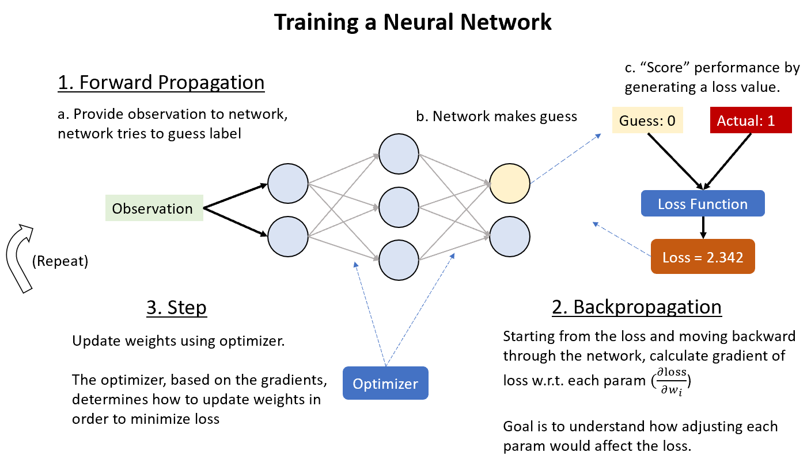
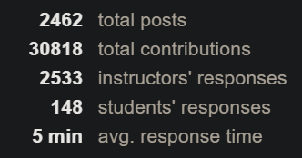

# Portfolio

* TOC
{:toc}

-----
## Social Distancing Detection

Above: Similar product by [Landing AI](https://syncedreview.com/2020/04/20/landing-ai-social-distancing-detector-monitors-workplaces/).

During my last internship, I built a system that tracks various metrics related to social distancing in retail spaces. It was based on computer vision-generated trajectories.

-----
## Trajectory Compression

I also researched, selected, and implemented a state-of-the-art trajectory compression algorithm.

For our applications it was projected to compress trajectories up to 15x, while also removing noise from the data.

-----
## Speech Transcription

Trained a neural network that converts input audio directly to text for the Intro to DL course at CMU.

Based on transcription accuracy (with no misc error correction systems), placed #17 of 278 students in the course.

Implemented [Listen Attend Spell (Chan et al, 2015)](https://arxiv.org/abs/1508.01211) from scratch with PyTorch, trained on AWS. 

-----

## Intro to DL

TA'd for the [11-785 Introduction to Deep Learning](http://deeplearning.cs.cmu.edu/F20/index.html) course at CMU.

### Homeworks

**Description:**

Wrote four homework assignments for the course:
* [hw1](http://deeplearning.cs.cmu.edu/F20/document/homework/Homework_1_1.pdf): Recreating [PyTorch](https://pytorch.org/) and automatic differentiation
* [hw1bonus](http://deeplearning.cs.cmu.edu/F20/document/homework/Homework_1_Bonus.pdf): Adam, Dropout, and BatchNorm
* [hw2](http://deeplearning.cs.cmu.edu/F20/document/homework/Homework_2_1.pdf): Convolutional Neural Networks (CNNs)
* [hw2bonus](http://deeplearning.cs.cmu.edu/F20/document/homework/Homework_2_Bonus.pdf): 2d Convolutional Networks

-----

### Recitations - Matrix Calc and Homework Bootcamp
<iframe src="https://youtube.com/embed/PB0yQlFU2Ds" frameborder="0" allowfullscreen></iframe>

<iframe src="https://youtube.com/embed/MARCktJrk0s" frameborder="0" allowfullscreen></iframe>

-----
### Misc

Answered over 3400 student questions on Piazza

Our average response time (24/7) was 5 minutes per question

-----
## Music

I also do a lot of music : )

<iframe src="https://youtube.com/embed/OqmTRVhBP_8" frameborder="0" allowfullscreen></iframe>

From my undergrad a cappella group, the [Pikers](http://pikers.wustl.edu/).